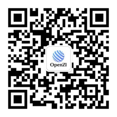

# OpenZIEditor

EN：OpenZIEditor is one of the OpenZILab team products , use for develop digital twins and metaverse projects. This project made by unreal to build a real world. Our team use Cesium and UE5 together to solve the problem how a digital twins project easy to be develop. We provide a plugin named OpenZIAPI to add to your digital twins and metaverse projects.Many Companies who want to buid a digital twins can easily done this work by only know web develop. And also our way to provide project let everyone can add c++ and blueprint to there projects.

The license for now if you need to use our product in Non-commercial the you can free to use it to study and research. If you use it for Commercial use you need to get our Commercial Licensing. Please connect support@openzi.com or visit our website [OpenZI website](http://cengzi.com/) for more informations.

中文：OpenZIEditor 是我们OpenZILab团队的产品，是用来开发数字孪生和元宇宙项目使用的。这个项目采用虚幻引擎构建一个真实的世界。我们的团队为解决数字孪生项目构建难的问题使用Cesium和UE5一起使得数字孪生项目更加轻松得开发。我们提供了一个叫做OpenZIAPI的插件扩展你的数字孪生和元宇宙项目。许多传统可视化公司可通过这种方式在只有Web技术栈时候构建数字孪生项目 并且我们提供了工程使得每个人都可以添加C++ 和蓝图进行扩展他们得项目。

如果你使用我们得产品在非商业用途，你可以随意学习和研究。如果你想用在商业项目中，需要我们的商业授权许可，请联系support@openzi.com或访问我们的公司官网[OpenZI官方网站](http://cengzi.com/)获取更多信息。

下方二维码：

企业微信交流群  ||   微信公众号  ||  企业视频号  ||  企业微信客服

产品相关授权内容：

如您在非商业领域使用，公司所有产品均可免费使用，如果在商用领域则全产品需要付费获取许可，许可后取消运行六小时之后的产品水印。

产品商业授权许可售价：API产品 5W/套 平台产品 10W/套 云渲染产品 10W/套

注：由于产品分离业务和平台设计，如您使用平台产品则需要同时购买业务API产品（合计15W）；目前商业授权以公司为单位许可授权，获取授权许可后永久使用（非单机授权）合同授权版本和之后一年内免费对应产品更新版本。本公司保留产品所有权和知识产权，详情欢迎咨询企业客服进行详细了解。

[点击访问文档](http://doc.cengzi.com:3000/)                       [点击访问官网](http://www.cengzi.com/)